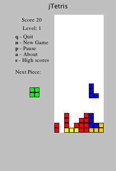

# JTetris

Use arrow keys to rotate and position blocks.

This is an ancient game that I found on an old floppy disk that I made when I was a kid. Please don't judge my ability based on this code!

## Running pre-built binary

[Download jar file](https://github.com/unqueued/JTetris/raw/dist/JTetris.jar)

```
java -jar JTetris.jar
```

## Building

If you want to build it yourself instead of downloading binary, then:

```
make jar

java -jar JTetris.jar

```

## Screenshot


